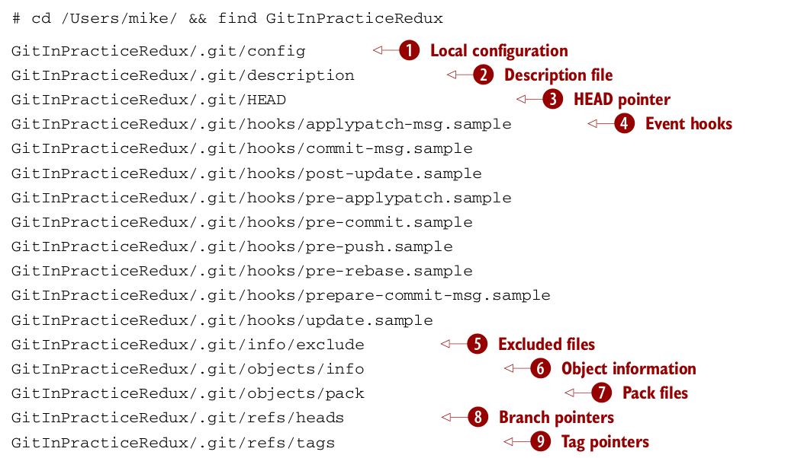
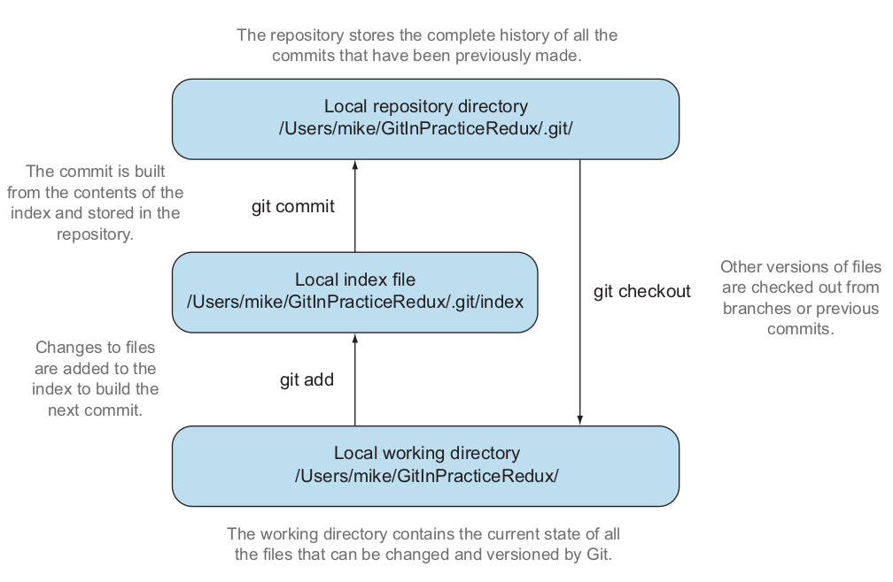
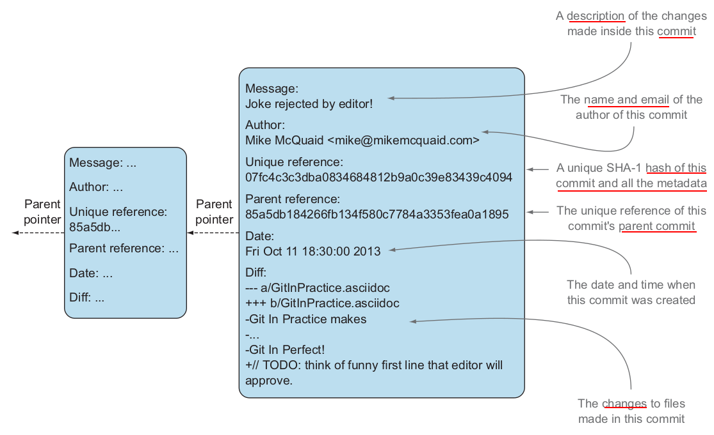
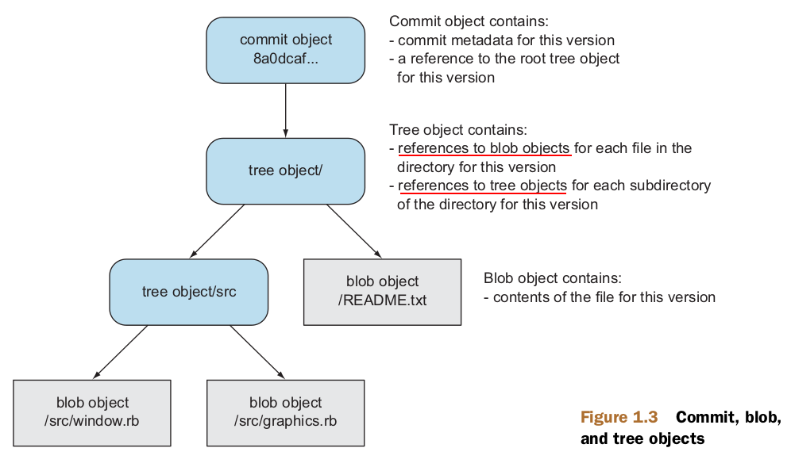

# Git 
- Git is a version control system built on top of an object store
- Git creates and stores a collection of objects when you commit
- A tree object stores a reference to all the blob objects at a particular point in time
- A blob object stores the contents of a particular version of a particular single file in the Git repository

## Setting a name and email address
```bash
git config --global user.name "Nguyen Van A"
git config --global user.email "nguyenvana@gmail.com"
```

## Create git repository
```bash
git init
```

- 1 - contains the configuration of the local repository
- 2 - describes the repository
- 3, 8, 9 - contains head pointer, branch pointers, and tag pointers, that point to commits
- 4 - show event hooks such as pre-commit is run before every new commit is made
- 5 - contains files that should be excluded from the repository
- 6, 7 - contain object information and pack file, that are used for object storage and reference



## Commit
```bash
git add .
git commit -m "commit message"
```


