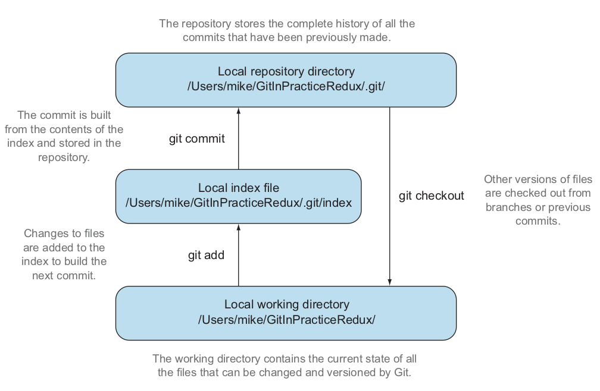

# Git 
- Git is a version control system built on top of an object store
- Git creates and stores a collection of objects when you commit
- A tree object stores a reference to all the blob objects at a particular point in time
- A blob object stores the contents of a particular version of a particular single file in the Git repository

## Setting a name and email address
```bash
git config --global user.name "Nguyen Van A"
git config --global user.email "nguyenvana@gmail.com"
```

## Create git repository
```bash
git init
```

- 1 - contains the configuration of the local repository
- 2 - describes the repository
- 3, 8, 9 - contains head pointer, branch pointers, and tag pointers, that point to commits
- 4 - show event hooks such as pre-commit is run before every new commit is made
- 5 - contains files that should be excluded from the repository
- 6, 7 - contain object information and pack file, that are used for object storage and reference



## Commit
```bash
git add .
git commit -m "commit message"
```


- The only commit lacks a parent commit is initial commit 

## Viewing history 
- This history also contains references to any <b>branches</b>, <b>merges</b>, <b>tags</b>

- Ideally, commits are small and well-described
    - Why are small commits better? - describe a single change, it can be easily reverted 
    - The commit message is structured like an email. It is used as a summary
```bash
git log --patch --stat
---
commit xxx (HEAD -> python)
Author: xxx <xxx@gmail.com>
Date:   Sun Jan 31 20:11:53 2021 +0700

    change api
---
 __pycache__/handleInput.cpython-36.pyc                         | Bin 0 -> 1131 bytes
 __pycache__/helper.cpython-36.pyc                              | Bin 0 -> 1352 bytes
 app.py                                                         |  30 +++++++++++++++++++++++-------
 ...
 6 files changed, 23 insertions(+), 7 deletions(-)
```

## How to use `git diff`
- Difference between any 2 commits, branches, tags
 
- Consider difference between 2 commit 
    - Add new window 
    - Add new button
    - Using `git diff master~1 master`
- Extensing for using path parameter
```bash
git diff master~1 master -- ./src/main
```
- Differences between the current workspace and the last commit on the default master branch
```bash
git diff master
```
- Differences between the index staging area and the current state of the files tracked by Git
```bash
git diff
```
- Differences words
```bash
git diff --word-diff master
---
Word: [-Git-]{+Gi+}
Line: {+## How to use `git diff`+}
```
## Refs 
- In git, refs are the posible ways for addressing individual commits

- For example , `git diff` invocations are all equivalent:
    - `git diff master~1 master`
    - `git diff master~1..master`
    - `git diff master~1..`
    - `git diff master^ master`
    - `git diff master~1 HEAD`
    - `git diff xxxxxxx yyyyyyy`

## How to see what SHA-1 a given ref
```bash
git rev-parse master
---
6b437c7739d24e29c8ded318e683eca8f03a5260

git rev-parse 6b437c7
---
6b437c7739d24e29c8ded318e683eca8f03a5260
```