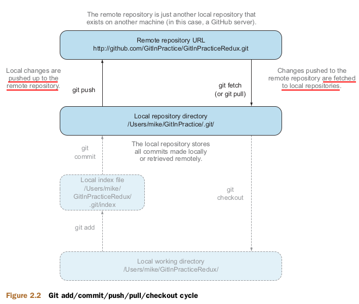
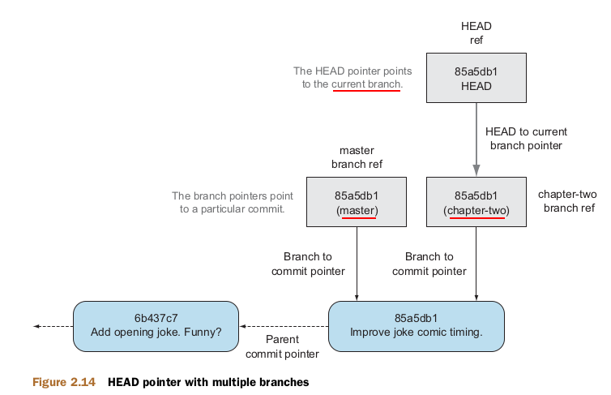

# Remote git
- Sharing changes: from sending files to a remote server for backup to collaborating as part of a large development team 
- Team collaboration also requires knowledge of how to create and interact with branches for working on different features in parallel


## Note
- Don't using command like `git push --force ...`

## How to operation `git remote`
- Adding remote git with name "origin"
```bash
git remote add origin https://github.com/thanhgit/
xxx.git
```
- Show remote git
```bash
git remote -v
---
origin	git@github.com:thanhgit/xxx.git (fetch)
origin	git@github.com:thanhgit/xxx.git (push)

git remote show
---
origin
```
- Delete remote git
```
git remote remove origin
```

## How to push changes
```bash
git push --set-upstream origin master
```
```bash
git push -u origin master
```
```bash
Branch 'master' set up to track remote branch 'master' from 'origin'.

```
- `--set-upstream` option: you tell Git that you want the local master branch, that track the origin remote's branch master
- A tracking branch is the default push or fetch location for a branch 

## How to use `git pull`
- Consist of 2 actions:
    - Fetching the changes from a remote repository
    - Merging them into the current branch
- Git pull downloads the new commits from another repository and merges the remote branch into the current branh
    - `Already up-to-date`: no change
- Take `--rebase` flag that performs a rebase rather than a merge
- What did a merge happen? 
    - When pulling changes from a remote branch into current branch => a merge must be make to reconcile the differing local and remote branches

## How to use `git fetch`
```bash
git fetch origin
```
- Prefer to use `git fetch` over `git pull`
- Then, you can use merging or rebasing to collaborate source code
## How to use `git branch`
- Branching allows 2 independent tracks through history to created and commited to without either modifying the other

    - The HEAD pointer moved from the master to the chapter-two branch when using `git checkout chapter-two`
## How to use `git tag`
- A tag is similar to a branch, but it points to a single commit and remains pointing to the same commit even when new commits are made